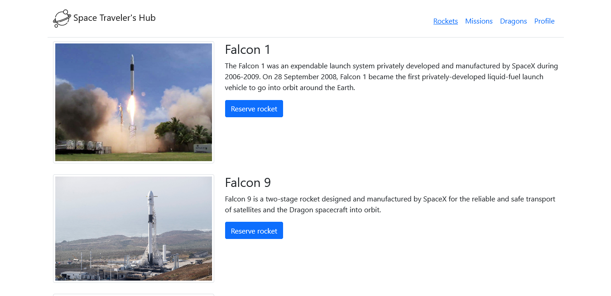

# Space Travelers' Hub


> Book rockets and join space missions



Space Travelers' Hub is an application that allows you to book rockets and join space missions for commerial and scientific purpose.

## Built With

- React
- Redux

## Live Demo

[Live Demo Link](https://competent-pasteur-0ea516.netlify.app/)

## Getting Started

To get a local copy up and running follow these simple example steps.

### Prerequisites

- NodeJS - [v16.x](https://nodejs.org/en/)

### Setup

```bash
git clone https://github.com/usmansbk/react-group-project.git
cd ./react-group-project
```

### Install

```bash
npm install
```

### Usage

```bash
npm start
```

### Build

```bash
npm run build
```

### Run tests

```bash
npm test
```

## Authors

👤 **Babakolo Usman Suleiman**

- GitHub: [@usmansbk](https://github.com/usmansbk)
- LinkedIn: [LinkedIn](https://www.linkedin.com/in/usmansbk/)

👤 **Hiro Mataba**

- GitHub: [@hiromataba](https://github.com/hiromataba)
- LinkedIn: [LinkedIn](https://www.linkedin.com/in/aganzemataba)

👤 **Omoogun Olawale**

- GitHub: [@olawale-o](https://github.com/olawale-o)
- LinkedIn: [LinkedIn](https://www.linkedin.com/in/olawaleomoogun/)

## 🤝 Contributing

Contributions, issues, and feature requests are welcome!

Feel free to check the [issues page](../../issues/).

## Show your support

Give a ⭐️ if you like this project!

## Acknowledgments

- Microverse
- App Logo from [FlatIcons](https://www.flaticon.com/free-icon/planet_3212567?term=space&page=1&position=19&page=1&position=19&related_id=3212567&origin=style)

## 📝 License

This project is [MIT](./MIT.md) licensed.
